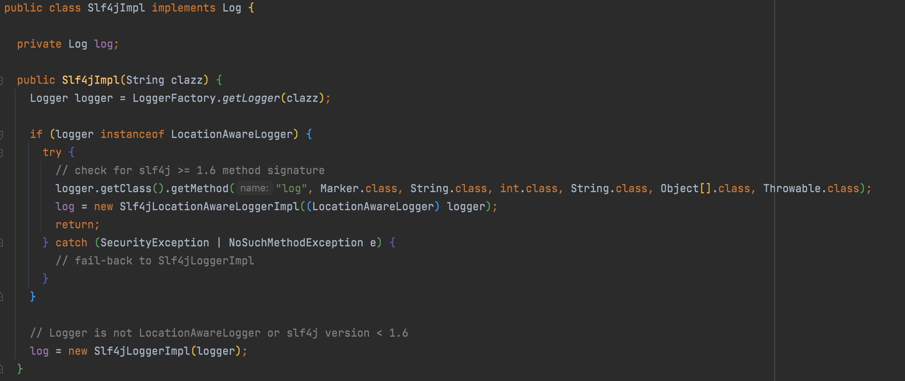

# 设计模式——适配器模式(Adapter)

## 定义：

> 将一个类的接口转换成客户希望的另外一个接口，使得原本由于接口不兼容而不能一起工作的那些类能一起工作。

> 适配器模式涉及的三个角色:
> * 源（Adaptee）：需要被适配的对象（苹果自带的USB-C接口）
> * 适配器（Adapter）：连接目标与源的中间件（USB-C 转 3.5 毫米耳机插孔转换器）
> * 目标（Target）：期望得到类型（3.5 毫米耳机插孔）

## 在实际项目中的使用情况

> MyBatis的日志类

## 总结

### 使用场景：

> * 你想使用一个已经存在的类，但是它的接口不符合你的需求。
> * 你想创建一个可以复用的类，该类与其他不相关的类或不可预见的类协同工作。
> * 你想使用一些已经存在的类，但是不可能对每一个都进行子类化以匹配他们的接口。

